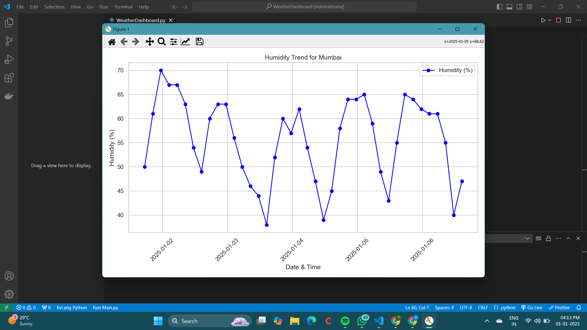

# API Integration and Data Visualization

## Developer Information
**Name:** shaik burujula jeevanbi 
**Company:** CODTECH IT SOLUTIONS  
**ID:** CTO6DL935  
**Domain:** PYTHON PROGRAMMING  
**Duration:** may 5th,2025 to june 20th,2025 

---

## Overview of the Project
### Task 1: API Integration and Data Visualization

This project focuses on integrating the OpenWeatherMap API to fetch weather data and visualizing it using Python libraries such as Matplotlib and Seaborn.

---

## Objective
To demonstrate how to integrate a public API, process the fetched data, and create visualizations for meaningful insights.

---

## Key Activities
1. Setting up a Python environment for API integration and data visualization.
2. Fetching 5-day weather forecast data using the OpenWeatherMap API.
3. Parsing and extracting temperature and humidity data from the API response.
4. Visualizing trends in temperature and humidity over time using Matplotlib and Seaborn.

---

## Technologies Used
- **Python**: Programming language for API integration and data manipulation.
- **Requests**: Library for making HTTP requests to the OpenWeatherMap API.
- **Matplotlib**: Library for creating static, animated, and interactive visualizations.
- **Seaborn**: Statistical data visualization library built on Matplotlib.

---

## Scope
- Fetch real-time weather data for any city.
- Visualize temperature and humidity trends over a 5-day period.
- Provide insights into weather patterns for specific locations.

---

## Advantages
- Demonstrates real-world use of APIs for data fetching.
- Offers clear visual insights into weather trends.
- Easy to customize for other cities or parameters.

---

## Disadvantages
- Limited to the functionality and data provided by the OpenWeatherMap API.
- Dependent on internet connectivity for data fetching.

---

## Key Insights
- Visualization helps in identifying trends in weather data effectively.
- API integration streamlines the process of fetching and processing data.

---

## Future Improvements
- Add more weather parameters like wind speed or precipitation.
- Develop a dashboard for interactive visualizations.
- Implement error handling for edge cases and API failures.
- Integrate with other APIs for a more comprehensive dataset.

---

## Code Explanation
1. **API Integration**:
   - `requests.get()` is used to fetch weather data.
   - The API key and city name are passed as parameters.
2. **Data Parsing**:
   - The JSON response is parsed to extract dates, temperatures, and humidity values.
3. **Visualization**:
   - Line plots are created for temperature and humidity trends using Matplotlib and Seaborn.

---

## Contact
For any questions or feedback, feel free to reach out to:  

**shaik burujula jeevanbi**
**Company:** CODTECH IT SOLUTIONS  
**Email:** tommyjaan1@gmail.com  
